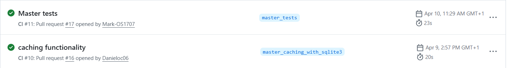

# Team Collaboration Log

## Roles
- Daniel O'Conor - Developer 
- Mark O'Sullivan - Testing and Documentation
- Ted McGrath - Leader
- Kevin Murphy - Testing and Documentation
## Ceremonies
We held regular team meetings throughout the project to plan and review progress.

- **Weekly Tuesday Meetings** - The team met Tuesday mornings at tutorials which allowed us to update each other on progress and know what our plan for the following week ahead was.
- **Microsoft Planner** - The team's plans were often inputted into the Microsoft planner board to ensure each member was aware of tasks to be completed and work remaining.

## Project Board
We used Microsoft Planner as our Kanban board to track tasks throughout the project. The board was with one member however if a task wanted to be added, team members would advise the planner that they would like to add the task to the board which would then be inputted.

### Board Structure 
The board was divided into four columns:

### Column and Purpose 
- **Backlog** - Tasks identified for the project

- **Doing** - Tasks being actively worked on

- **Review** - Tasks completed and awaiting review

- **Done** - Tasks were completed by using the tickbox on the backlog column, however tasks could also be confirmed to be completed by inputting them into the Done column.

Link to Microsoft Planner Board: https://planner.cloud.microsoft/webui/plan/gFNTTN5sYEym-QVFN-vAcpYABSQ5/view/board?tid=46fe5ca5-866f-4e42-92e9-ed8786245545

## Pull Request Evidence 

### PR

1. PR#17 

2. PR#16 

3. PR#12 

### Branch
1. master_tests - main 

2. Master_caching_with_sqlite3 - main

3. Master_new_html - main 
### Description
1. Added pytest's  

2. Caching Functionality

3. HTML
### Author 
1. Mark O'Sullivan
2. Daniel O'Conor
3. Daniel O'Conor

## Evidence:

